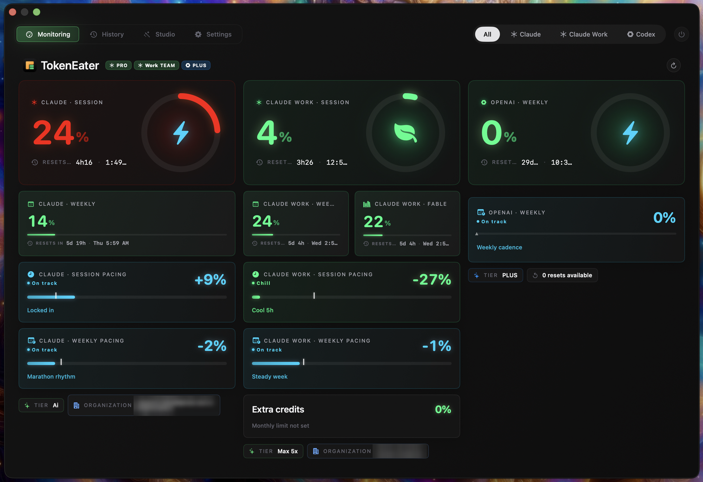
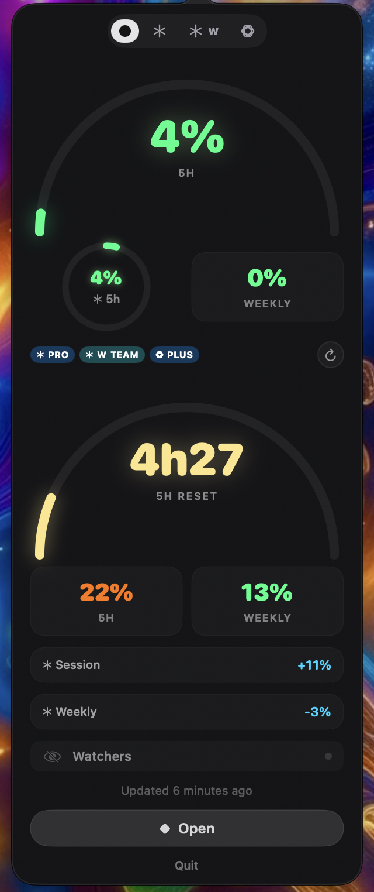
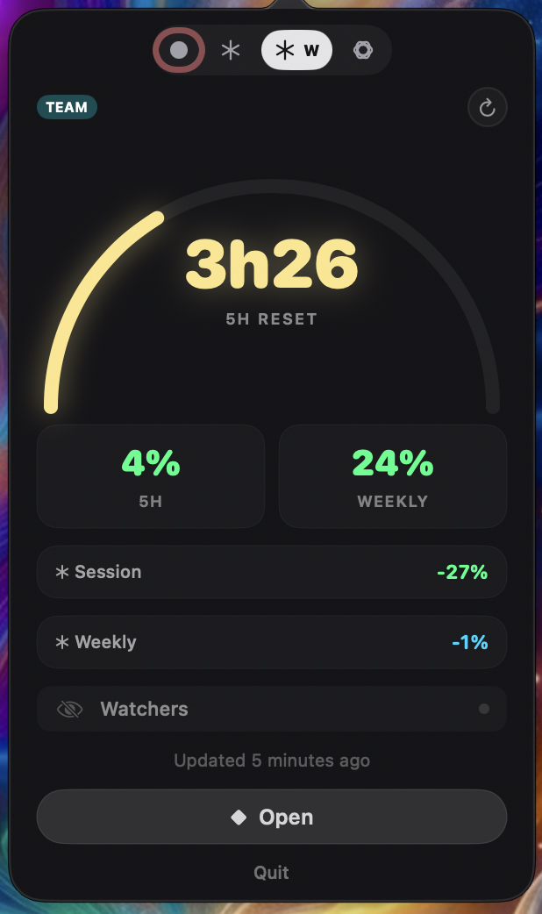
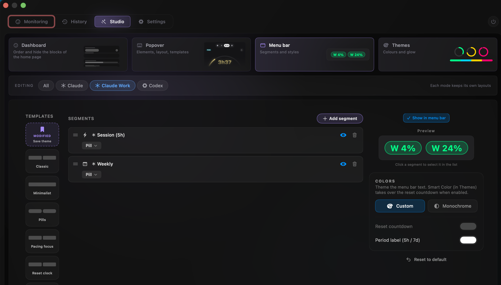
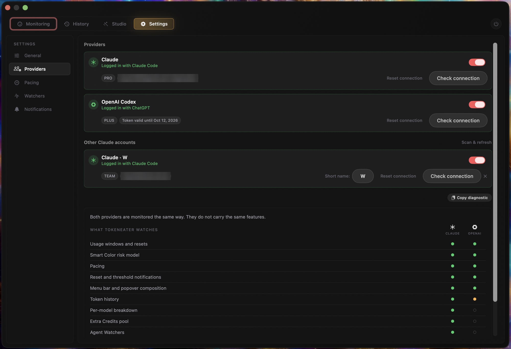

<p align="center">
  
</p>

<h1 align="center">TokenEater</h1>

<p align="center">
  <strong>Monitor your Claude and Codex usage limits directly from your macOS desktop.</strong>
</p>

<p align="center">
  <a href="https://tokeneater.athevon.dev">Website</a> ·
  <a href="#install">Install</a> ·
  <a href="#what-you-get">Features</a> ·
  <a href="#privacy-read-only-usage-calls">Privacy</a> ·
  <a href="https://tokeneater.athevon.dev/en/docs">Docs</a> ·
  <a href="https://github.com/AThevon/TokenEater/releases">Releases</a>
</p>

<p align="center">
  
  
  
  
  
  
  
  
  <a href="https://github.com/sponsors/AThevon"></a>
</p>

---

> [!NOTE]
> **This fork adds multiple Claude accounts.** It tracks a second Claude Code login (for example a personal and a work account) as a provider of its own, next to Claude and Codex, with no logging in and out. Everything else is [AThevon/TokenEater](https://github.com/AThevon/TokenEater), and all credit for the app goes there. The change is proposed upstream in [#284](https://github.com/AThevon/TokenEater/pull/284).

### Why this fork exists

When I started my new job I ended up with a work Claude account alongside my personal one, and I realised the need almost immediately. TokenEater had become how I keep an eye on my limits, and logging in and out of Claude Code to check the other account defeated the point. So I built the version I wanted, matching the app's own design as closely as I could, and proposed it upstream.

<p align="center">
  
</p>

<table>
  <tr>
    <td align="center" width="33%"><br><sub><b>Popover, All</b><br>both accounts and Codex</sub></td>
    <td align="center" width="33%"><br><sub><b>Second account's mode</b><br>its own plan, hero and pacing</sub></td>
    <td align="center" width="33%"><br><sub><b>Studio</b><br>its own segments and styles</sub></td>
  </tr>
</table>

<p align="center">
  <br>
  <sub>Menu bar: your pills, then the second account's, labelled with its short name</sub>
</p>

<p align="center">
  <br>
  <sub>Settings &gt; Providers: each extra account gets the same card, toggle and connection buttons</sub>
</p>

### What the fork adds

| | |
|---|---|
| **Its own mode** | A fourth dot in the switcher: All · Claude · your second account · Codex |
| **Side by side** | All mode shows both Claude accounts in the popover, the menu bar and as a third dashboard column |
| **Same design** | The second account uses the app's own cells, pills, hero and pacing cards, so nothing looks bolted on |
| **Studio** | Every scope lists the second account's metrics under their own heading, to place and style like any other |
| **Short name** | You choose how it is labelled (up to 6 characters, like `W` or `Work`) in Settings > Providers |
| **Read-only** | Same contract as upstream: it reads each login from the Keychain and never writes or refreshes a token |

### Set up a second account

Claude Code keeps each config directory's login separately, so log the second account in under its own:

```bash
CLAUDE_CONFIG_DIR=~/.claude-work claude   # then /login with the other account
```

TokenEater picks it up on its own (or press **Scan & refresh** in Settings > Providers). macOS asks once to allow Keychain access for it; choose **Always Allow**.

### Build this fork

```bash
git clone -b feat/multi-claude-accounts https://github.com/Mayukh-D/TokenEater.git
cd TokenEater
xcodegen generate
xcodebuild -project TokenEater.xcodeproj -scheme TokenEaterApp -configuration Release \
  -derivedDataPath build DEVELOPMENT_TEAM="" CODE_SIGN_STYLE=Manual CODE_SIGN_IDENTITY="-" build
cp -R build/Build/Products/Release/TokenEater.app /Applications/
```

Local builds are not notarized, so the first launch needs right-click > Open. Needs Xcode and `brew install xcodegen`.

---

> **Requires a Claude Pro, Max, or Team plan, or the Codex CLI signed in with ChatGPT.** Either one is enough. Claude's free plan does not expose usage data, and Codex API-key accounts have no usage windows to track.

<!--
Screenshots slot. Four shots, ~200px wide each, dropped into docs/assets/readme/:
  popover.png    (menu bar + popover dashboard)
  monitoring.png (main window, Monitoring space)
  watchers.png   (Agent Watchers overlay over a desktop)
  widgets.png    (desktop widgets)
Then wire them here as a centered row:
<p align="center">
  
  ...
</p>
-->

## What you get

A native menu bar app, desktop widgets, and a floating overlay that track your Claude and OpenAI Codex usage in real time, side by side or one at a time.

- **Menu bar.** Live percentages with color-coded thresholds, and a popover dashboard you compose element by element (rings, chips, arcs, pacing bars at full, half, or third width), start from built-in templates, and save as your own.
- **Dashboard.** A four-space window (Monitoring / History / Studio / Settings) with flippable tiles, 7-day sparklines, peak day, and a pacing-vs-equilibrium graph. Its blocks reorder and hide from Studio, like the popover and the menu bar.
- **Two providers, one app.** Claude and OpenAI Codex are equals: the menu bar, the popover, the dashboard, widgets, notifications and History cover both. An All / Claude / Codex mode scopes every surface at once, All puts the two side by side, and each mode keeps its own layouts. Track only one and you never see a trace of the other.
- **History.** Combined Claude Code and Codex tokens from local session logs: a stacked chart by model, project ranking, session counts, and cache hit rate, filterable by Claude family or Codex model across 24h to 90d ranges. The History widget shows the combined daily totals.
- **Widgets.** Native WidgetKit gauges, progress bars, and pacing, refreshed reactively, with a Codex Usage widget alongside the Claude ones.
- **Agent Watchers.** A floating overlay of your live Claude Code sessions, terminals and VSCode-family extensions alike. Click a session to jump to its terminal or editor (Terminal, iTerm2, tmux, Kitty, WezTerm), right-click for quick actions.
- **Smart Color.** Blends how much you have used with how fast you are burning, so the color warns you before the number does. Three temperaments set how cautious it is.
- **Smart pacing.** Are you burning through tokens or cruising? Four zones: chill, on track, warning, hot.
- **Themes.** Four presets plus full custom colors, a glow or flat look, and configurable warning thresholds.
- **Notifications.** Per-event toggles for each provider: escalation, recovery, pacing, scheduled reset reminders, extra credits, token expiry. Every alert names the provider it is about.

Everything in detail on the [website](https://tokeneater.athevon.dev).

## Install

### Download DMG (recommended)

**[Download TokenEater.dmg](https://github.com/AThevon/TokenEater/releases/latest/download/TokenEater.dmg)**

Open the DMG, drag TokenEater to Applications, and launch it. The DMG is signed with a Developer ID and notarized by Apple, so Gatekeeper lets it run on first launch without any extra steps.

### Homebrew

```bash
brew tap AThevon/tokeneater
brew trust AThevon/tokeneater
brew install --cask tokeneater
```

> `brew trust` is required on Homebrew 6.0+, which no longer loads a third-party tap until you trust it.

### First setup

**Prerequisites:** at least one of [Claude Code](https://docs.anthropic.com/en/docs/claude-code) signed in on a **Pro, Max, or Team plan** (`claude` then `/login`), or the [Codex CLI](https://github.com/openai/codex) signed in with your **ChatGPT account** (`codex login`).

1. Open TokenEater: a guided setup detects the providers on your Mac and walks you through connecting the ones you use
2. Right-click on the desktop > **Edit Widgets** > search "TokenEater"

## Update

TokenEater checks for updates automatically. When a new version is available, a modal lets you download and install it in-app; macOS will ask for your admin password to replace the app in `/Applications`.

If you installed via Homebrew: `brew update && brew upgrade --cask tokeneater`

## Uninstall

Delete `TokenEater.app` from Applications, then optionally clean up shared data:

```bash
rm -rf /Applications/TokenEater.app
rm -rf ~/Library/Application\ Support/com.tokeneater.shared
```

If you installed via Homebrew: `brew uninstall --cask tokeneater`. For a complete wipe, caches and widget state included, use the clean reset in the [troubleshooting guide](docs/TROUBLESHOOTING.md).

## Build it yourself

```bash
git clone https://github.com/AThevon/TokenEater.git
cd TokenEater
./build.sh
```

The script checks Xcode, installs XcodeGen if needed, and assembles the app. Local builds are not notarized, so Gatekeeper blocks the first launch (right-click > Open, or System Settings > Privacy & Security > Open Anyway). The step-by-step walkthrough is in [`SETUP.md`](SETUP.md).

## Privacy: read-only usage calls

TokenEater reads the **OAuth access token** Claude Code already keeps in your macOS Keychain, the same token Claude Code itself uses. At first launch, macOS asks you to allow that access: click **Always Allow** once. The prompt is standard macOS behavior for any app reading a keychain item it did not create, and since the read goes through Apple's own `security` tool, whose signature never changes, the prompt does not come back on updates.

Everything the app does with the token:

- `GET api.anthropic.com/api/oauth/usage`, your current usage stats
- `GET api.anthropic.com/api/oauth/profile`, your plan info

When Codex tracking is enabled, the app also reads the Codex CLI access token from `~/.codex/auth.json` (or `CODEX_HOME`) and makes one additional authenticated call:

- `GET chatgpt.com/backend-api/wham/usage`, your Codex usage windows and credits

These usage and profile calls are read-only. TokenEater does not send messages, read conversations, or modify either account. Each access token is sent only to its own provider. TokenEater never writes to either provider's credentials and never refreshes their tokens: if one expires, open Claude Code or Codex (or run `codex login`) and it picks the new one up. API-key and keyring-only Codex logins are not supported in this version.

Widgets read local JSON files with no network or Keychain access. The Codex widget reads `codex.json` for usage and `shared.json` for theme preferences; its cache contains no token, email, or account ID. History reads Claude Code and Codex local session logs without uploading them; Agent Watchers reads Claude Code sessions.

Anthropic does not offer a third-party OAuth flow or scoped tokens yet, so reading the existing token is the only way an app like this can exist. If scoped tokens become available, TokenEater will adopt them immediately. The relevant code is short and auditable: keychain access in [`SecurityCLIReader.swift`](Shared/Services/SecurityCLIReader.swift) and [`TokenProvider.swift`](Shared/Services/TokenProvider.swift), the Claude calls in [`APIClient.swift`](Shared/Services/APIClient.swift), and Codex access in [`CodexAuthReader.swift`](Shared/Services/CodexAuthReader.swift) and [`CodexAPIClient.swift`](Shared/Services/CodexAPIClient.swift).

## Codex setup and widgets

Sign in to the Codex CLI with your ChatGPT account. TokenEater enables Codex tracking automatically on the first launch that detects that login. If you sign in later, turn it on under **Settings > Providers**, where each provider has its own tracking switch and the coverage matrix shows what each feature does on each one. Agent Watchers stay a Claude Code feature: they read Claude Code's own session processes, which Codex has no equivalent of. The onboarding wizard sets up either provider or both, and you can finish it with OpenAI alone.

History includes local sessions from both providers, independently of quota authentication. It reads Codex `sessions/` and `archived_sessions/` under `CODEX_HOME` (default `~/.codex`). `All` sums uncached input, cache writes, and output tokens for both providers. Only cache reads count as reused tokens in the cache breakdown. Guardian / auto-review sessions are excluded from all History statistics and the History widget. Reasoning tokens are already included in Codex output. Models are discovered from the logs and have individual filters. The History widget receives seven calendar-day totals from the app, refreshed every minute while TokenEater runs; it does not read session files itself.

In **Edit Widgets > TokenEater**, choose **Codex Usage** (small or medium) alongside **Claude Overview**, **Claude Session Ring**, or the other Claude widgets. Existing Claude widgets keep their identity when upgrading; only their gallery names change. Codex windows are labelled by duration, so weekly-only plans show a weekly window rather than an invented five-hour session.

## If something breaks

| Symptom | Cause | Fix |
|---------|-------|-----|
| "Rate limited" or "API unavailable" | Your OAuth token has hit its per-token request limit | Run `claude /login` for a fresh token; TokenEater detects the change and recovers within seconds |
| Keychain popup on first run | A new install needs authorization to read your Claude Code token | Click **Always Allow** once; it sticks across updates |
| "Authorization needed" that will not go away | A cached credential went stale, or a second Keychain item shadows your login | **Settings > Providers > Reset connection**: it rereads everything from scratch and keeps all your settings. **Copy diagnostic** says which case you are in |
| Widget stuck or not updating | macOS caches widget extensions aggressively | Remove the widget, run the clean reset, re-add the widget |

Anything deeper, including the full clean reset that wipes caches, preferences, and widget state, lives in the [troubleshooting guide](docs/TROUBLESHOOTING.md).

## Documentation

- [Setup](SETUP.md), building from source step by step
- [Troubleshooting](docs/TROUBLESHOOTING.md), common fixes and the clean reset
- [Contributing](CONTRIBUTING.md), workflow, commit conventions, and testing
- [AGENTS.md](AGENTS.md), architecture, data flow, and the SwiftUI rules, for contributors and AI agents alike
- [Design system](docs/design/MASTER.md), how the windows are built and colored

## Contributing

Contributions are welcome: bug reports, feature ideas, and code PRs all help. Start with [`CONTRIBUTING.md`](CONTRIBUTING.md); it covers the workflow and a few SwiftUI rules worth knowing before touching the code.

## Support

TokenEater is free and open source. If it saves you from hitting your limits blindly, you can [sponsor its development on GitHub](https://github.com/sponsors/AThevon).

## License

MIT

---

<p align="center">
  Built by <a href="https://athevon.dev"><strong>Adrien Thevon</strong></a>, software engineer in Toulouse.
  <br />
  <sub>
    Also mine:
    <a href="https://github.com/AThevon/genjutsu">genjutsu</a>, creative coding skills for Claude
    &nbsp;·&nbsp;
    <a href="https://github.com/AThevon/worktigre">worktigre</a>, a git worktree manager
  </sub>
</p>
